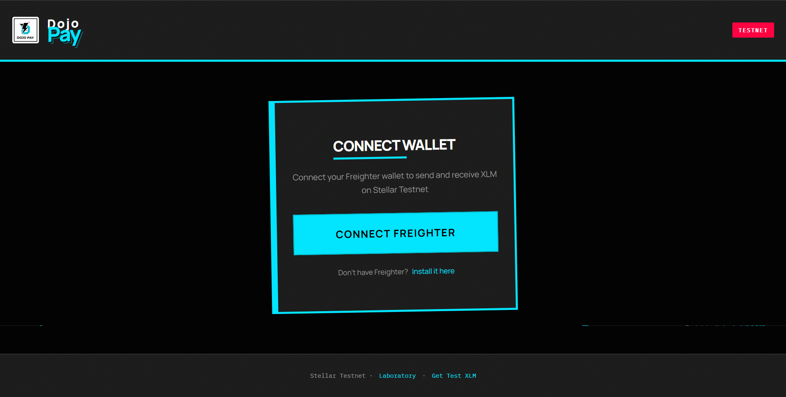
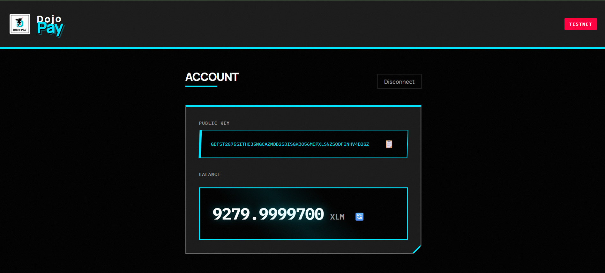
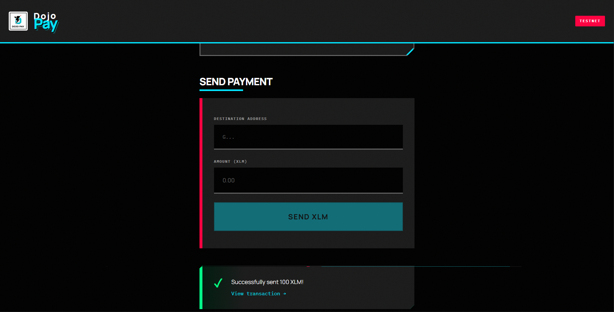

# ⚡ Dojo Pay

<div align="center">


**A brutalist Stellar payment dApp built with precision and power**

[](https://www.stellar.org/)
[](https://react.dev/)
[](https://vitejs.dev/)
[](LICENSE)

### 🌐 [**Live Demo →**](https://dojo-pay-two.vercel.app)

</div>

## 🎯 Overview

Dojo Pay is a minimalist Stellar payment application that embodies **Financial Brutalism** - trust through clarity, power through simplicity. Built for the Stellar White Belt certification, it demonstrates direct blockchain interactions without smart contracts or backend infrastructure.

### Design Philosophy

- **High-Contrast Brutalism**: Noir black meets electric cyan
- **Typography as Architecture**: IBM Plex Mono + Manrope
- **Clarity Over Ornamentation**: Every pixel serves a purpose
- **WCAG AAA Accessibility**: 7:1+ contrast ratios throughout

## ✨ Features

### 🔐 Wallet Management
- Seamless Freighter wallet integration
- Connect/disconnect with transaction persistence
- Public key display with one-click copy
- Real-time XLM balance tracking

### 💸 Payment Operations
- Send XLM to any Stellar address
- Live address validation
- Precision amount handling (7 decimal places)
- Instant balance updates post-transaction

### 📊 Transaction Feedback
- Success/error status with visual indicators
- Transaction hash with Stellar Expert links
- Loading states and animations
- Persistent transaction history

## 🖼️ Screenshots

<div align="center">

### Connect Wallet

*Clean connection interface with brutalist aesthetics*

### Account Dashboard

*High-contrast account display with balance tracking*

### Send Payment

*Transaction interface with real-time validation*

</div>

## 🚀 Quick Start

### Prerequisites

1. **Freighter Wallet**
   ```
   Download: https://www.freighter.app/
   Network: Switch to Testnet in settings
   ```

2. **Testnet XLM**
   ```
   Friendbot: https://friendbot.stellar.org
   Fund your account with free testnet XLM
   ```

### Installation

```bash
# Clone the repository
git clone https://github.com/yourusername/dojo-pay.git
cd dojo-pay

# Install dependencies
npm install

# Start development server
npm run dev
```

The app will be available at `http://localhost:5173`

### Build for Production

```bash
# Create optimized build
npm run build

# Preview production build
npm run preview
```

## 🏗️ Architecture

```
┌─────────────────────────────────────┐
│        Dojo Pay (React)            │
│  ┌──────────────────────────────┐  │
│  │   UI Components (Brutalist)  │  │
│  └─────────────┬────────────────┘  │
│                │                    │
│  ┌─────────────▼────────────────┐  │
│  │   Freighter Wallet API       │  │
│  └─────────────┬────────────────┘  │
└────────────────┼────────────────────┘
                 │
       ┌─────────▼──────────┐
       │  Stellar Testnet   │
       │  (Horizon API)     │
       └────────────────────┘
```

**Pure Frontend** - No backend, no smart contracts, direct Stellar integration.

## 📁 Project Structure

```
dojo-pay/
├── src/
│   ├── App.jsx           # Main application component
│   ├── App.css           # Brutalist design system
│   ├── wallet.js         # Freighter wallet integration
│   ├── stellar.js        # Stellar network operations
│   ├── main.jsx          # React entry point
│   └── index.css         # Global styles
├── public/
│   └── DojoPay.png       # Application logo
├── Sample1.png           # Screenshot: Connect
├── Sample2.png           # Screenshot: Account
├── Sample3.png           # Screenshot: Payment
├── package.json
└── vite.config.js
```

## 🛠️ Tech Stack

| Technology | Version | Purpose |
|------------|---------|---------|
| **React** | 19.2.0 | UI framework |
| **Vite** | 7.2.4 | Build tool & dev server |
| **Stellar SDK** | 14.5.0 | Blockchain operations |
| **Freighter API** | 6.0.1 | Wallet integration |
| **IBM Plex Mono** | - | Technical typography |
| **Manrope** | - | Display typography |

### Design Tokens

```css
/* Monochrome Foundation */
--noir: #000000
--charcoal: #1a1a1a
--paper: #f8f8f8
--white: #ffffff

/* Accent Palette */
--cyan-electric: #00e5ff
--signal-red: #ff0040
--signal-green: #00ff88
```

## 📖 Usage Guide

### 1️⃣ Connect Your Wallet
1. Click **"Connect Freighter"** button
2. Approve the connection in Freighter popup
3. Your public key and balance appear instantly

### 2️⃣ Send XLM
1. Enter destination address (G...)
2. Specify amount (min: 0.0000001 XLM)
3. Click **"Send XLM"**
4. Sign transaction in Freighter
5. View confirmation with transaction hash

### 3️⃣ Track Transactions
- Click transaction hash to view on Stellar Expert
- Balance auto-refreshes after successful send
- Copy public key with one click

## ✅ White Belt Requirements

- [x] **Wallet Connection** - Freighter integration ✅
- [x] **Balance Display** - Real-time XLM tracking ✅
- [x] **XLM Transfer** - Send to any address ✅
- [x] **Transaction Feedback** - Success/error states ✅
- [x] **No Smart Contracts** - Pure payment operations ✅
- [x] **No Backend** - Direct Stellar integration ✅
- [x] **Public Repository** - Open source ✅
- [x] **Live Deployment** - Production ready ✅

## 🌐 Deployment

### Vercel (Recommended)

```bash
# Install Vercel CLI
npm install -g vercel

# Deploy
npm run build
vercel --prod
```

### Netlify

```bash
# Build
npm run build

# Deploy dist folder
# Drag to https://app.netlify.com/drop
```

## 🔧 Configuration

The app is configured for **Stellar Testnet**:

```javascript
// stellar.js
const server = new StellarSdk.Horizon.Server(
  'https://horizon-testnet.stellar.org'
);
const NETWORK_PASSPHRASE = StellarSdk.Networks.TESTNET;
```

> ⚠️ **Warning**: Do NOT use on Mainnet without proper security audits!

## 🧪 Testing

### Manual Checklist
- [x] Wallet connects and disconnects
- [x] Public key displays correctly
- [x] Balance fetches and updates
- [x] Valid transactions succeed
- [x] Invalid addresses rejected
- [x] Transaction hashes link correctly
- [x] Error states display properly
- [x] Responsive on mobile devices

## 📚 Resources

- **Stellar Docs**: [developers.stellar.org](https://developers.stellar.org/)
- **Freighter Docs**: [docs.freighter.app](https://docs.freighter.app/)
- **Stellar SDK**: [stellar.github.io/js-stellar-sdk](https://stellar.github.io/js-stellar-sdk/)
- **Horizon API**: [developers.stellar.org/api/horizon](https://developers.stellar.org/api/horizon)
- **Stellar Expert**: [stellar.expert/explorer/testnet](https://stellar.expert/explorer/testnet)

## 🎓 Stellar Certification Path

**Current**: White Belt ✅

**Next Steps**:
- **Yellow Belt**: Custom asset issuance
- **Orange Belt**: Decentralized applications
- **Green Belt**: Soroban smart contracts

## 💬 Support

- **Stellar Discord**: [discord.gg/stellar](https://discord.gg/stellar)
- **Stack Exchange**: [stellar.stackexchange.com](https://stellar.stackexchange.com/)

## 🤝 Contributing

Contributions welcome! Please feel free to submit a Pull Request.

1. Fork the repository
2. Create your feature branch (`git checkout -b feature/amazing`)
3. Commit your changes (`git commit -m 'Add amazing feature'`)
4. Push to the branch (`git push origin feature/amazing`)
5. Open a Pull Request

## 📄 License

MIT License - Free to use for learning and development.

---

<div align="center">

**Built on Stellar Testnet**

</div>
