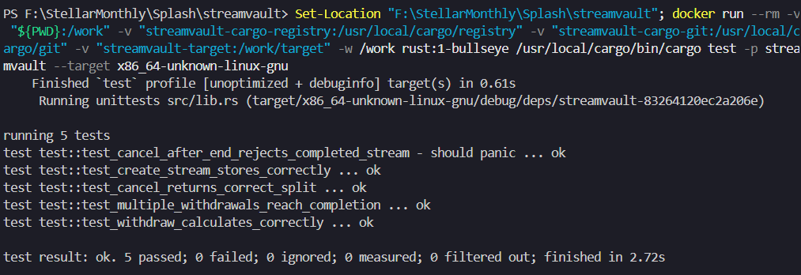

# Splash


**Splash** is a Level 3 Stellar Soroban mini-dApp for real-time token payment streams. The MVP centers on a deployed `StreamVault` contract that lets a sender lock funds, stream value to a recipient over time, let the recipient withdraw accrued funds, and let the sender cancel an active stream with the unearned balance refunded.

## Submission Links

| Requirement | Link / Evidence |
|---|---|
| Public GitHub repository | <https://github.com/sukrit-89/Splash> |
| Live demo | Add the Vercel or Netlify URL after deployment |
| Demo video | Add the 1-minute Loom or YouTube URL after recording |
| Test output screenshot | [Testcase.png](Testcase.png) |
| Testnet `StreamVault` contract | `CCE2PSOOTQWLNCY3RFJOSI7RNIRVQFE64L33KJNBXTXOW63YVRRQLFA6` |
| Stellar testnet RPC | `https://soroban-testnet.stellar.org` |

## Level 3 Checklist

| Requirement | Status |
|---|---|
| Mini-dApp fully functional | Implemented with React, Freighter wallet connection, StreamVault contract calls, local cache, loading states, stream creation, dashboard, withdraw, and cancel flows |
| Minimum 3 tests passing | Passed, with 5 Soroban contract tests |
| README complete | This README documents the product, architecture, contract interface, setup, tests, deployment config, and demo checklist |
| Demo video recorded | Pending recording |
| Minimum 3+ meaningful commits | Satisfied, repository history contains more than 3 implementation commits |
| Public GitHub repository | Pushed to `origin/main` |
| Test screenshot in README | Included below |

## Test Evidence

The Level 3 requirement asks for a screenshot showing at least 3 passing tests. The current contract suite passes 5 tests.



Latest verified result:

```text
running 5 tests
test result: ok. 5 passed; 0 failed
```

## What Splash Does

Most payments move in batches: weekly payroll, monthly invoices, delayed contractor payouts, or milestone escrow. Splash turns payment into a live flow. The sender deposits the full stream amount into a Soroban contract, and the recipient earns funds second by second until the stream ends, is withdrawn, or is cancelled.

Level 3 intentionally keeps the system focused:

- One `StreamVault` Soroban contract
- One deployed testnet contract address
- One React mini-dApp
- Freighter wallet signing
- Real contract transactions through Stellar RPC
- Local stream metadata caching for fast page reloads
- Tests proving core create, withdraw, completion, and cancel behavior

Level 4 items such as `StreamFactory`, Blend yield, `FLOW` token receipts, richer event indexing, mobile polish, and CI/CD are documented in [PRD.MD](PRD.MD) but are outside this Level 3 submission.

## Architecture

```text
User wallet
   |
   | Freighter signs Soroban transactions
   v
React + Vite frontend
   |
   | @stellar/stellar-sdk over Stellar RPC
   v
StreamVault contract on Stellar testnet
   |
   | invokes Stellar Asset Contract transfer
   v
XLM SAC or demo USDC SAC
```

### Frontend Responsibilities

- Connect to Freighter and display the active wallet address.
- Validate the stream creation form before signing.
- Convert user-facing token amounts into smallest-unit contract values.
- Submit `create_stream`, `withdraw`, and `cancel` transactions.
- Show loading and confirmation states while transactions are pending.
- Cache stream metadata in `localStorage` so the dashboard opens quickly after refresh.
- Show a live ticking claimable balance, backed by contract data.

### Contract Responsibilities

- Require sender authorization when creating or cancelling a stream.
- Require recipient authorization when withdrawing.
- Lock the full stream deposit in the contract.
- Calculate claimable funds from ledger time, rate, and prior withdrawals.
- Prevent overpayment beyond the deposited amount.
- Refund unearned funds to the sender when cancelled before the end time.
- Mark streams as active, completed, or cancelled.

## Repository Layout

```text
.
|-- README.md
|-- PRD.MD
|-- AGENTS.md
|-- splash.png
|-- Testcase.png
|-- frontend
|   |-- index.html
|   |-- package.json
|   |-- public
|   `-- src
|       |-- components
|       |-- hooks
|       |-- lib
|       |-- pages
|       `-- types
`-- streamvault
    |-- Cargo.toml
    |-- README.md
    |-- scripts
    |   `-- test-docker.ps1
    `-- contracts
        `-- streamvault
            |-- Cargo.toml
            |-- Makefile
            `-- src
                |-- lib.rs
                `-- test.rs
```

## Contract Interface

| Function | Auth | Parameters | Returns | Description |
|---|---|---|---|---|
| `create_stream` | Sender signs | `sender`, `recipient`, `token`, `rate_per_second`, `duration_seconds` | `stream_id: u64` | Locks `rate_per_second * duration_seconds` from the sender and stores stream metadata. |
| `withdraw` | Recipient signs | `stream_id` | `amount: i128` | Transfers currently claimable funds to the recipient and completes the stream when fully withdrawn. |
| `cancel` | Sender signs | `stream_id` | `(recipient_owed, sender_refund)` | Before stream end, pays earned funds to the recipient and refunds unearned funds to the sender. |
| `get_claimable` | None | `stream_id` | `i128` | Returns currently withdrawable funds without mutating state. |
| `get_stream` | None | `stream_id` | `Stream` | Returns sender, recipient, token, rate, deposit, withdrawn amount, timestamps, and status. |
| `get_stream_count` | None | none | `u64` | Returns the next stream id, useful for discovery and post-create lookup. |

## Contract Data Model

The Level 3 contract stores one compact stream record per `stream_id`.

| Field | Meaning |
|---|---|
| `sender` | Wallet that funds the stream |
| `recipient` | Wallet allowed to withdraw accrued funds |
| `token` | Soroban token contract address, such as native XLM SAC or demo USDC SAC |
| `rate_per_second` | Smallest token units earned each second |
| `total_deposit` | Full amount locked at stream creation |
| `already_withdrawn` | Amount already paid to the recipient |
| `start_timestamp` | Ledger timestamp at stream creation |
| `end_timestamp` | `start_timestamp + duration_seconds` |
| `status` | `Active`, `Cancelled`, or `Completed` |

Core calculation:

```text
claimable = min(now, end_timestamp) - start_timestamp
claimable = claimable * rate_per_second - already_withdrawn
claimable = min(claimable, total_deposit - already_withdrawn)
```

## Testnet Configuration

| Item | Value |
|---|---|
| Network | Stellar testnet |
| Passphrase | `Test SDF Network ; September 2015` |
| RPC URL | `https://soroban-testnet.stellar.org` |
| StreamVault contract | `CCE2PSOOTQWLNCY3RFJOSI7RNIRVQFE64L33KJNBXTXOW63YVRRQLFA6` |
| Native XLM SAC | `CDLZFC3SYJYDZT7K67VZ75HPJVIEUVNIXF47ZG2FB2RMQQVU2HHGCYSC` |
| Demo USDC SAC | `CBR7ZWCNWEX43SLWEQCMJBXZLBP5U46EV2DQ2EKYED65DJKL4SX6TRRF` |

The demo USDC value is a testnet asset contract used for this belt submission. It is not Circle production USDC.

## Local Setup

Clone the repository:

```powershell
git clone https://github.com/sukrit-89/Splash.git
Set-Location Splash
```

Install frontend dependencies:

```powershell
Set-Location .\frontend
npm install
```

Create `frontend/.env.local` from `frontend/.env.example`:

```text
VITE_STELLAR_RPC_URL=https://soroban-testnet.stellar.org
VITE_STELLAR_NETWORK_PASSPHRASE=Test SDF Network ; September 2015
VITE_STREAMVAULT_CONTRACT_ID=CCE2PSOOTQWLNCY3RFJOSI7RNIRVQFE64L33KJNBXTXOW63YVRRQLFA6
VITE_USDC_TOKEN_CONTRACT_ID=CBR7ZWCNWEX43SLWEQCMJBXZLBP5U46EV2DQ2EKYED65DJKL4SX6TRRF
VITE_XLM_TOKEN_CONTRACT_ID=CDLZFC3SYJYDZT7K67VZ75HPJVIEUVNIXF47ZG2FB2RMQQVU2HHGCYSC
```

Run the frontend:

```powershell
npm run dev
```

Build the frontend:

```powershell
npm run build
```

## Wallet And Token Notes

- Install Freighter and switch it to Stellar testnet.
- Fund testnet accounts with Friendbot before creating streams.
- The app signs transactions in the browser through Freighter.
- `XLM` in the token picker means the Soroban Stellar Asset Contract for native XLM.
- The demo USDC contract is for testing the dApp flow only.
- Do not commit private keys, funded secrets, mnemonics, or `.env.local`.

## Testing

Run contract tests from the `streamvault` workspace:

```powershell
Set-Location .\streamvault
cargo test -p streamvault
```

On Windows, the Docker test path is more consistent:

```powershell
Set-Location .\streamvault
.\scripts\test-docker.ps1
```

Equivalent Docker command:

```powershell
Set-Location "F:\StellarMonthly\Splash\streamvault"
docker run --rm `
  -v "${PWD}:/work" `
  -v "streamvault-cargo-registry:/usr/local/cargo/registry" `
  -v "streamvault-cargo-git:/usr/local/cargo/git" `
  -v "streamvault-target:/work/target" `
  -w /work `
  rust:1-bullseye `
  /usr/local/cargo/bin/cargo test -p streamvault --target x86_64-unknown-linux-gnu
```

The current Level 3 suite covers:

| Test | Purpose |
|---|---|
| `test_create_stream_stores_correctly` | Verifies stream creation and stored metadata |
| `test_withdraw_calculates_correctly` | Verifies elapsed-time claimable calculation |
| `test_cancel_returns_correct_split` | Verifies recipient payout and sender refund on cancellation |
| `test_multiple_withdrawals_reach_completion` | Verifies multiple withdrawals accumulate to completion |
| `test_cancel_after_end_rejects_completed_stream` | Verifies completed streams cannot be cancelled |

## Contract Build

Build optimized WASM:

```powershell
Set-Location .\streamvault
stellar contract build --package streamvault
```

Expected output:

```text
streamvault/target/wasm32v1-none/release/streamvault.wasm
```

## Deployment

Deploy StreamVault to Stellar testnet:

```bash
stellar contract deploy \
  --wasm target/wasm32v1-none/release/streamvault.wasm \
  --source streamflow-dev \
  --network testnet
```

Deploy the frontend to Vercel or Netlify from the `frontend/` folder and set the same `VITE_*` environment variables from the setup section. After deployment, update the live demo row in this README with the production URL.

## Demo Video Checklist

Record a 1-minute video that shows:

1. Opening the deployed frontend.
2. Connecting Freighter on testnet.
3. Creating a stream with XLM or demo USDC.
4. Seeing the dashboard and live ticking claimable balance.
5. Withdrawing accrued funds or cancelling the stream.
6. Showing the success confirmation.

After uploading the video, update the demo video row in this README.

## Tech Stack

| Layer | Technology |
|---|---|
| Smart contract | Rust, Soroban SDK |
| Contract tests | `soroban_sdk::testutils`, Dockerized Rust runner |
| Frontend | React, Vite, TypeScript |
| Styling | Tailwind CSS |
| Wallet | Freighter |
| Stellar client | `@stellar/stellar-sdk` with Stellar RPC |
| Cache | Browser `localStorage` |
| Deployment target | Soroban testnet contract and Vercel or Netlify frontend |

## Security Notes

- Contract authorization uses Soroban `require_auth`.
- The frontend never stores secret keys.
- `.env.local` is ignored and must stay out of version control.
- Testnet addresses and contracts are safe to document; private keys are not.
- The Level 3 implementation avoids Level 4 yield and factory assumptions.

## Product Direction

Splash is being built in small, verifiable increments:

1. **Level 3:** prove the core StreamVault primitive with a working mini-dApp, tests, docs, and testnet deployment.
2. **Level 4:** add factory-based stream discovery, Blend integration, `FLOW` token receipts, event indexing, mobile polish, and CI/CD.

The full product plan and scope boundaries are documented in [PRD.MD](PRD.MD).
